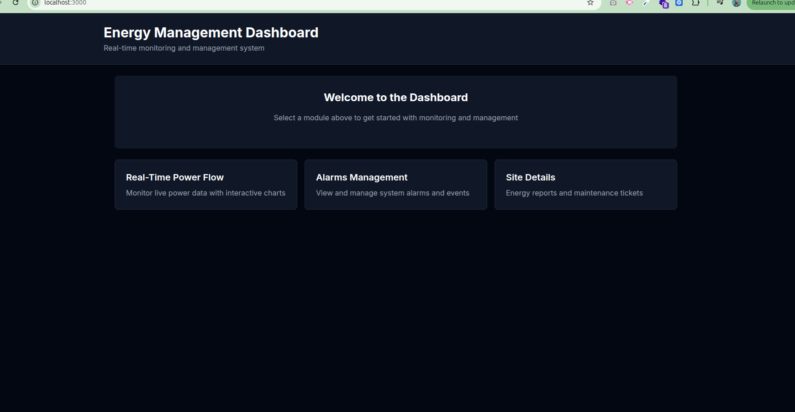
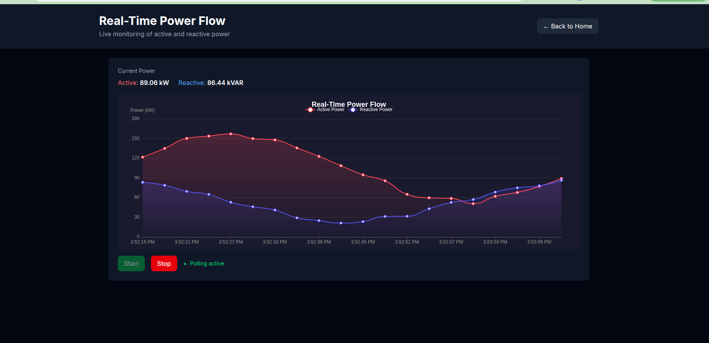
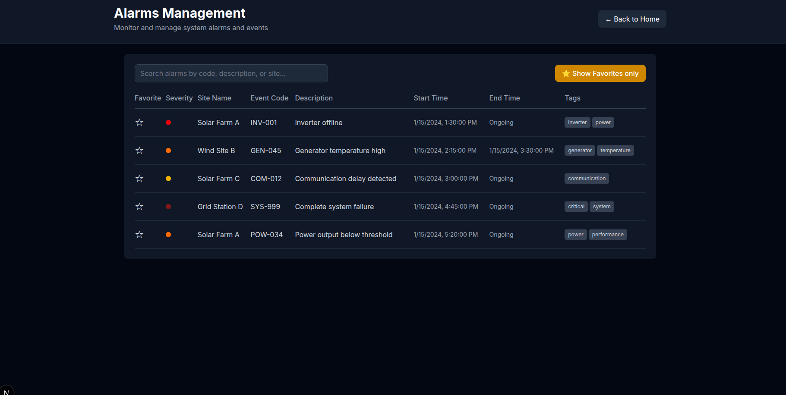
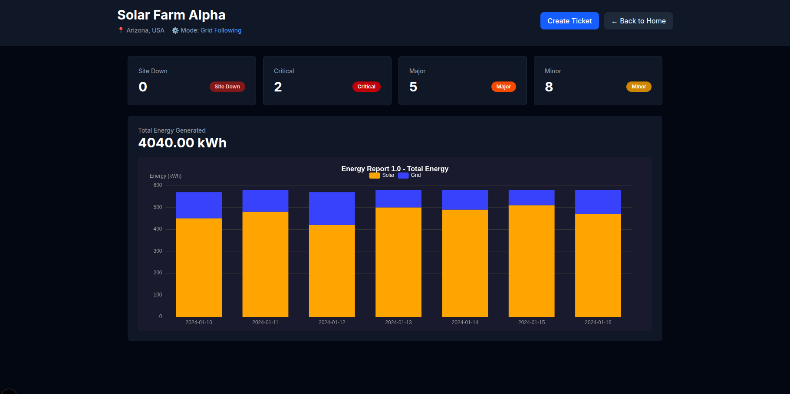
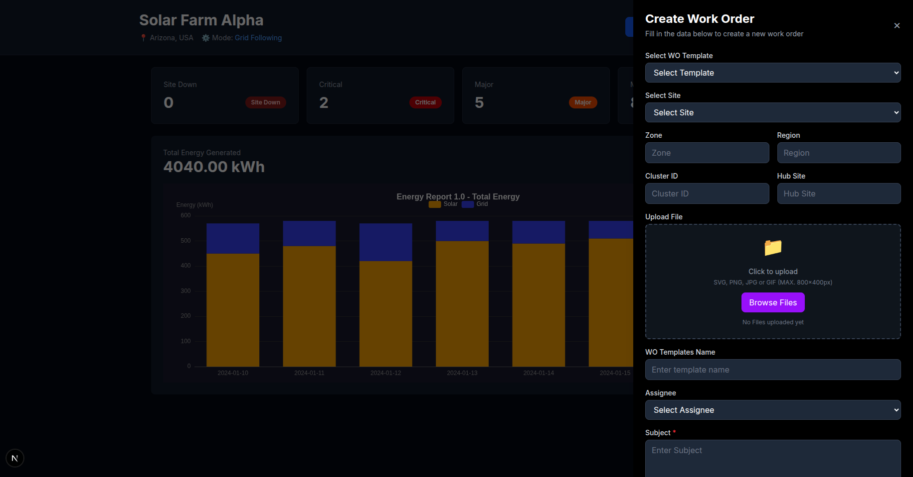

# Mini Energy Management Dashboard

A real-time energy monitoring and management system built with Next.js, Redux Toolkit, and ECharts.

---

## 📋 Overview

This project implements three main modules:
1. **Real-Time Power Flow** - Live chart with 60-second polling
2. **Alarms Management** - Searchable events table with favorites
3. **Site Details** - Energy reports and maintenance ticket creation

---

## 🚀 Setup Instructions

### Prerequisites
- Node.js 18 or higher
- Yarn package manager

### Installation Steps

1. **Clone the repository**
```bash
git clone <repository-url>
cd energy-management-dashboard
```

2. **Install dependencies**
```bash
yarn install
```

3. **Run development server**
```bash
yarn dev
```

4. **Open in browser**
```
http://localhost:3000
```

The application will start on port 3000.

---

## 🌍 Environment Variables

**Since we are using Mock data so This project does not require any environment variables.**

All data is generated through mock APIs that run locally within the Next.js application.

---

## 📡 Mock API Endpoints

### 1. Live Power Data
**Endpoint:** `GET /api/power/live`

**Description:** Returns 20 real-time power data points with Active and Reactive power values.

**Polling Behavior:**
- Automatically polled every 60 seconds when active
- Returns exactly 20 new data points per call
- Chart maintains a rolling window of 100 data points

**Response Example:**
```json
{
  "data": [
    {
      "timestamp": 1704067200000,
      "activePower": 125.45,
      "reactivePower": 58.32
    }
  ]
}
```

---

### 2. Alarms Endpoint
**Endpoint:** `GET /api/alarms`

**Query Parameters:**
- `search` (optional): Filter alarms by event code, description, or site name

**Examples:**
```bash
GET /api/alarms
GET /api/alarms?search=inverter
```

**Description:** Returns list of system alarms with severity levels, timestamps, and tags.

**Search Implementation:**
- Server-side filtering
- 400ms client-side debounce to optimize API calls
- Searches across: eventCode, description, siteName

**Response Example:**
```json
{
  "data": [
    {
      "id": "ALM001",
      "severity": "Critical",
      "siteName": "Solar Farm A",
      "eventCode": "INV-001",
      "description": "Inverter offline",
      "startTime": "2024-01-15T08:30:00Z",
      "endTime": null,
      "tags": ["inverter", "power"]
    }
  ]
}
```

---

### 3. Site Details Endpoint
**Endpoint:** `GET /api/site/:id`

**Parameters:**
- `id`: Site identifier (e.g., "1", "2")

**Description:** Returns site information, energy statistics, and alarm summary.

**Response Example:**
```json
{
  "data": {
    "siteInfo": {
      "id": "1",
      "name": "Solar Farm Alpha",
      "location": "Arizona, USA",
      "mode": "Grid Following"
    },
    "alarmSummary": {
      "siteDown": 0,
      "critical": 2,
      "major": 5,
      "minor": 8
    },
    "energyStats": [
      {
        "date": "2024-01-10",
        "solar": 450,
        "grid": 120
      }
    ]
  }
}
```

---

### 4. Maintenance Ticket Submission
**Implementation:** Client-side simulation using setTimeout (1.5 seconds delay)

**Description:** Simulates async ticket creation without actual backend submission.

**Actions:**
- **Submit** - Creates ticket with status "Open"
- **Save as Draft** - Creates ticket with status "Draft"

**Success/Error Handling:**
- Shows success toast notification on successful submission
- Shows error toast notification if submission fails
- Drawer closes automatically on success
- Form resets after successful submission

---

## 📸 Application Screenshots

### 🏠 Homepage / Dashboard


**Features:**
- Clean navigation to all three main modules
- Modern dark-themed interface
- Quick access cards with hover effects
- Direct links to Power Flow, Alarms Management, and Site Details

---

### ⚡ 1. Real-Time Power Flow (Live Chart)
**Route:** `/power`



**Features:**
- Real-time Active and Reactive Power visualization using ECharts
- Smooth line animations with sinusoidal waveforms
- Start/Stop controls for polling
- Rolling window of 100 data points
- Current power values display (Active kW and Reactive kVAR)
- Animated pulse indicator when polling is active

**Key Implementation:**
- Uses custom `usePolling` hook for interval management
- Redux `powerSlice` manages chart data and polling state
- 60-second automatic polling when active
- ECharts with gradient area fills

---

### 🚨 2. Alarms Management (Events Table)
**Route:** `/alarms`



**Features:**
- Dark-themed events table with complete alarm information
- Real-time search with 400ms debounce
- Favorites system with star/unstar functionality
- Toggle between "All Alarms" and "Favorites Only" view
- Severity indicators with colored circles (Site Down, Critical, Major, Minor)
- Event codes, descriptions, and timestamps
- Multiple tags display for each alarm
- Hover effects and responsive design

**Key Implementation:**
- Uses custom `useDebounce` hook for search optimization
- Redux `alarmSlice` manages alarms state and favorites
- Server-side filtering via query parameters
- Color-coded severity system for quick identification

---

### 🏭 3. Site Details (Energy Summary)
**Route:** `/site/:id` (e.g., `/site/1`)



**Features:**
- **Site Header** - Displays site name, location, and operating mode
- **Alarm Summary Cards** - Visual dashboard showing alarm counts by severity
  - Site Down (Dark Red)
  - Critical (Red)
  - Major (Orange)
  - Minor (Yellow)
- **Energy Report Chart** - Stacked bar chart displaying daily energy generation
  - Solar energy (orange bars)
  - Grid energy (blue bars)
  - Total energy display in kWh
  - 7-day historical data visualization
- **Create Ticket Button** - Opens maintenance work order drawer

**Key Implementation:**
- Dynamic routing with site ID parameter
- Redux `siteSlice` for site information and energy stats
- ECharts stacked bar chart for energy visualization
- Real-time data fetching from API

---

### 🔧 4. Maintenance Work Order Form


**Features:**
- **Side Drawer Interface** - Smooth slide-in animation with backdrop
- **Comprehensive Form Fields:**
  - WO Template selection dropdown
  - Site selection dropdown
  - Zone & Region (two-column layout)
  - Cluster ID & Hub Site (two-column layout)
  - File upload with drag-and-drop interface
  - WO Template Name input
  - Assignee selection dropdown
  - Subject textarea (required)
  - Activity Performer input (required)
  - Service Impact dropdown (required)
  - OpCAT T1 category selection (required)
  - OpCAT T2 sub-category selection (required)
  - Planned Start Time (datetime picker)
  - Planned End Time (datetime picker)
- **Action Buttons:**
  - Save as Draft (outlined purple button)
  - Submit (solid purple button)
- **Form Validation** - Required fields marked with asterisk
- **Toast Notifications** - Success/error feedback

**Key Implementation:**
- Redux `maintenanceSlice` for ticket management
- Full form state management with React hooks
- Toast notifications using Radix UI
- File upload handling
- Two submission modes: Draft and Submit
- Responsive drawer with smooth animations

---

## 🏗️ Tech Stack

- **Next.js 15** - React framework with App Router
- **TypeScript** - Type-safe development
- **Redux Toolkit** - State management
- **ECharts** - Data visualization
- **Tailwind CSS** - Styling
- **ShadCN & Radix UI** - UI Component

---

## 📄 License

This project is for assessment purposes.
